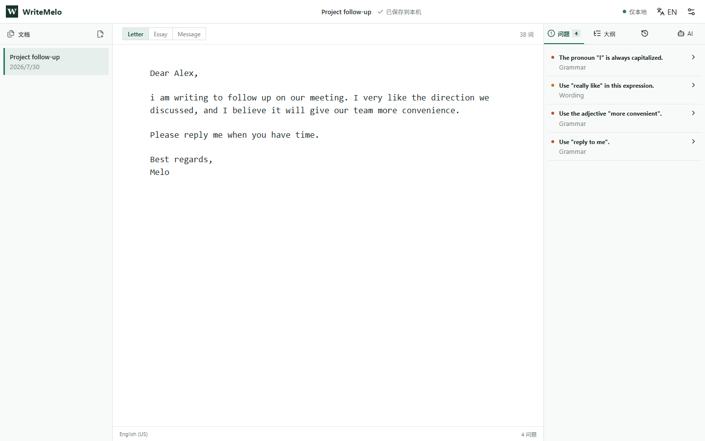

<div align="center">
  
  <p><strong>Complete words, catch mistakes, and understand why as you write.</strong></p>
  <p>
    <strong>English</strong>
    &nbsp;&middot;&nbsp;
    <a href="README.zh-CN.md">简体中文</a>
  </p>
  <p>
    
    
    
    
  </p>
</div>

---

> Spellcheck does too little, while AI rewriting often takes over. WriteMelo completes, diagnoses, and explains as you write, while you keep the final say.

WriteMelo is a local-first English writing IDE. It brings proven editor interactions to prose: contextual completion, diagnostics, quick fixes, document symbols, revision history, and optional AI. It is not a chat box and does not default to uploading or rewriting an entire draft.

This repository now has one product line. The previous Store-only and platform variants are archived in Git history; new work targets the shared TypeScript architecture.



**New here?** Follow the [complete guided demo](docs/DEMO.md) to see one email move through local completion, precise fixes, outline checks, revision history, AI consent, and BYOK.

## Why it exists

Early programming workflows separated editing, compiling, finding errors, and making fixes. Modern code editors brought completion, live diagnostics, quick fixes, project navigation, and revision history into one continuous workspace, so developers could focus on what they wanted to build.

English writing is still fragmented. Dictionaries look up words, spellcheckers draw red lines, grammar websites ask for pasted drafts, and AI chat often replaces the author's work. Context gets lost between tools, along with control over the final expression.

WriteMelo brings those capabilities into one writing workbench. It understands document-specific names and structure, offers local completion while typing, marks issues in the original text, and applies exact fixes. AI is called only when the writer explicitly chooses it.

| In a code editor | In WriteMelo |
| --- | --- |
| Language keywords | Level-aware English vocabulary |
| Project symbols | Proper names, acronyms, and product terms in the draft |
| Snippets | Reusable letter, essay, and message expressions |
| Language service | Local English context analysis |
| Quick Fix | Exact one-click corrections with explanations |
| Document symbols | Paragraph outline and submission checklist |
| Source control | Local revision snapshots and restore |
| AI coding assistant | Optional AI enabled only with consent |

## Core features

- English word and phrase completion powered by local rules and document entities.
- Proper-name, acronym, and mixed-case term reuse without boosting every repeated word.
- Offline English spelling with `nspell` and `dictionary-en`.
- Local grammar and wording diagnostics with exact one-click edits.
- Letter, essay, and message snippets and submission checklists.
- Document outline, local revisions, and personal dictionary.
- Simplified Chinese and English UI; US and UK English writing variants.
- IndexedDB storage in the web app and Electron profile storage on Windows.
- AI disabled by default, with separate consent for full-document transmission.
- Optional BYOK for OpenAI, Groq, Together AI, OpenRouter, Ollama, and compatible endpoints in the Windows app.

## Use cases

- **International students:** course assignments, group messages, and emails to instructors, with consistent course names, people, and terminology.
- **Employees in international workplaces:** English email, weekly reports, meeting notes, and work chat, with reusable project names and acronyms.
- **International trade and cross-border commerce:** inquiries, quotations, customer follow-ups, and support messages, using practical expressions without surrendering control of tone.
- **English learners and test takers:** essays, email tasks, and everyday writing, with explanations that teach rather than replace the learner's work.

## Get WriteMelo

<table>
  <tr>
    <td align="center" width="50%">
      <strong>Microsoft Store</strong><br /><br />
      <a href="https://apps.microsoft.com/detail/9NPGS9N22396">
        
      </a><br />
      <sub>Stable Windows release and automatic updates</sub>
    </td>
    <td align="center" width="50%">
      <strong>GitHub beta</strong><br /><br />
      <a href="https://github.com/ETOLucy/WriteMelo/releases/latest"><strong>Download installer or portable build</strong></a><br /><br />
      <sub>Latest preview with SHA-256 checksums</sub>
    </td>
  </tr>
</table>

Version 2.0 beta artifacts are clearly marked unsigned until the code-signing certificate is available.

## Architecture

```text
apps/web       React, CodeMirror, Dexie
apps/desktop   secure Electron delivery shell
apps/worker    Hono entry and existing Cloudflare Worker services
packages/
  contracts    shared data contracts
  i18n         zh-CN and English UI messages
  writing-core pure TypeScript completion and analysis
```

The writing core does not depend on React, Electron, Hono, Cloudflare, or an AI provider. UI events become a `WritingContext`; the core returns candidates, diagnostics, edits, outline items, and checklist results. The web app renders those results and persists documents locally. AI requests must cross a separate consent boundary.

See [Architecture](docs/product/ARCHITECTURE.md) and [Roadmap](docs/product/IMPLEMENTATION-ROADMAP.md).

## Development

Requirements: Node.js 22 or newer.

```powershell
npm install
npm run dev
npm test
npm run test:e2e
npm run build
```

The development UI runs at `http://127.0.0.1:4173`.

## Windows builds

```powershell
npm run package:windows
```

The command creates an NSIS installer and a portable executable in `release/`. Public beta artifacts are unsigned until the Microsoft code-signing certificate is available.

## Privacy

Documents, personal dictionary entries, and revisions stay on the device. Local completion, spelling, and diagnostics do not require an account or network request. BYOK keys are encrypted with Windows `safeStorage`; approved requests go directly to the selected provider, whose own retention and billing terms apply. See [Privacy](PRIVACY.md).

## Friendly links

- [LINUX DO - A new kind of community](https://linux.do/)

## License

WriteMelo is free software licensed under the [GNU General Public License v3.0](LICENSE) (`GPL-3.0-only`).
