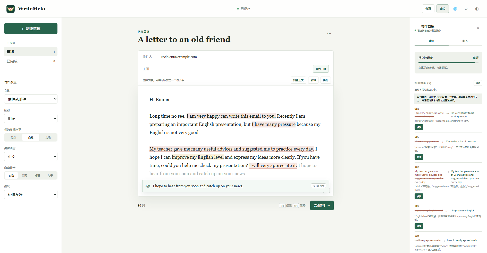
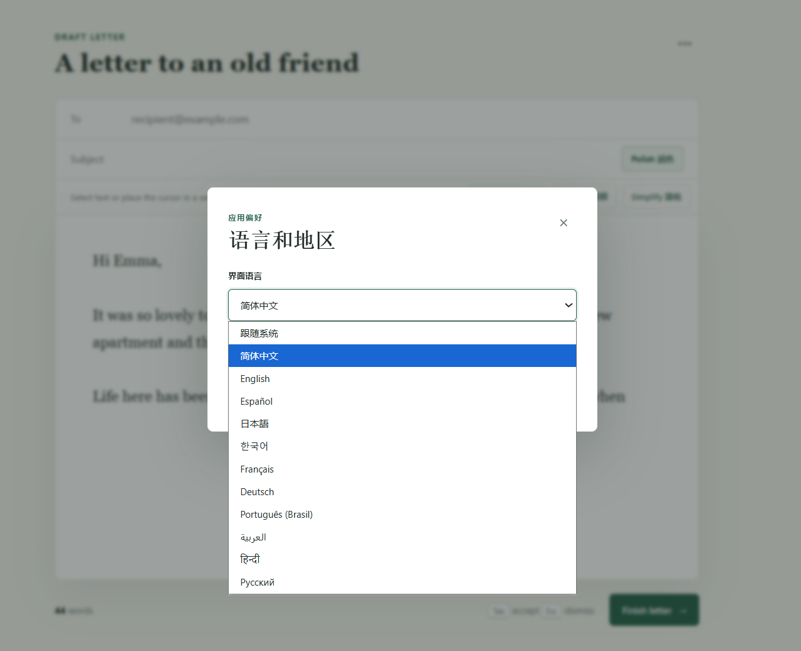
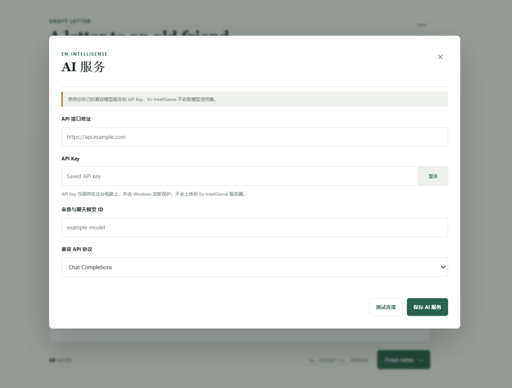

<div align="center">
  
  <p><strong>先理解你想表达什么，再帮你写得更自然。</strong></p>
  <p>Context-aware English completion, review, and rewriting for learners.</p>
  <p>
    <strong>English</strong>
    &nbsp;&middot;&nbsp;
    <a href="README.zh-CN.md">简体中文</a>
  </p>
  <p>
    <a href="#demo">See it in action</a>
    &nbsp;&middot;&nbsp;
    <a href="#download">Download</a>
    &nbsp;&middot;&nbsp;
    <a href="docs/USER_GUIDE.md">User Guide</a>
    &nbsp;&middot;&nbsp;
    <a href="docs/ROADMAP.md">Roadmap</a>
    &nbsp;&middot;&nbsp;
    <a href="#run">Run locally</a>
    &nbsp;&middot;&nbsp;
    <a href="https://github.com/ETOLucy/WriteMelo">GitHub Repository</a>
  </p>
  <p>
    
    
    
    <a href="LICENSE"></a>
  </p>
</div>

---

WriteMelo is an English writing coach for non-native speakers. It understands the intent behind the whole draft, explains corrections in the learner's preferred language, and combines contextual review with word, phrase, and sentence completion.

<a id="download"></a>

## Download

<a href="https://apps.microsoft.com/detail/9NPGS9N22396">
  
</a>

**Microsoft Store:** The product page will become available automatically after certification and publishing.

- **GitHub Releases**

  Download the latest installer or portable build from [GitHub Releases](https://github.com/ETOLucy/WriteMelo/releases/latest).

New users can follow the [User Guide](docs/USER_GUIDE.md) for setup and everyday writing.

## Demo



### Interface language

Choose from the 11 interface languages currently included in the app, or follow the Windows language.



### Bring your own AI service

Connect a compatible model endpoint with your own API key and model ID. The key stays on the Windows device and is protected with Windows encryption.



## Features

- Local word completion and model-powered phrase/sentence completion.
- Open, edit, and atomically save UTF-8 `.txt` and Markdown files in the Windows app while keeping the full writing coach available.
- Whole-draft intent inference passed into subsequent completions.
- Automatic and manual writing review for grammar, clarity, wording, repetition, and tone.
- Exact issue highlighting, source location, Chinese explanation, and one-click replacement.
- Subject and selected-text polishing with three level-appropriate alternatives.
- Translation, explanation, simplification, and contextual bilingual chat.
- Useful phrases replace the selection or current sentence instead of appending duplicate text.
- Letter, essay, and message formats with local draft persistence.
- Copy the complete current document in one click for letters, essays, and messages.
- Keep completed documents in a local Finished archive and reopen any item as an editable copy.

<a id="model-quota-and-privacy"></a>

## AI model, cost, and privacy

WriteMelo does not include a language model, shared API key, or free AI credit. AI completion, review, rewriting, and chat require each user to configure a model service that exposes a compatible Chat Completions or Responses endpoint. Any fees, rate limits, retention rules, and privacy terms belong to that provider; the project does not provide or endorse unofficial relay services.

Without an API key, the app still opens and supports local word completion, drafts, finished documents, and email handoff. The coach displays `Add API key for AI`; model-powered phrase/sentence completion, review, polish, and chat remain unavailable until configuration is added.

Drafts and finished documents remain in the current Windows user's local app profile; the application does not yet have a server-side account or draft database. Paid subscriptions are not included in the first release.

AI-powered actions send the relevant draft text to the provider selected by the user. The application does not persist those requests, and API responses use `Cache-Control: no-store`; review the provider's privacy terms before processing confidential or sensitive writing. A desktop `.env` file is local plaintext: keep it private, never commit it, and never paste an API key into a GitHub issue.

Self-hosted Cloudflare deployments can use Workers AI and consume the deploying account's quota. That quota is not bundled with the Windows EXE and is never shared from the maintainer's personal account.

## Configure

Copy `.env.example` to `.env` and enter credentials from your own provider:

```dotenv
MODEL_API_KEY=your_own_api_key
MODEL_BASE_URL=https://api.example.com
MODEL_ID=example-model
MODEL_API_STYLE=chat
```

Use a model ID supported by the selected service. The same model handles completion, tutoring, review, rewriting, and chat. Operators may later set the optional `MODEL_AUTOCOMPLETE_ID` override after validating a faster model in production.

Never commit `.env` or place an API key in browser-side JavaScript.

Source code and schema are public; customer data and production credentials are not. See [Open-source and private-data boundaries](docs/OPEN_SOURCE_BOUNDARIES.md) and run `npm run privacy` before committing or pushing.

Read the [Privacy Policy](PRIVACY.md) for details about local storage, third-party model processing, file access, retention, and deletion.

## Run

Python 3.9 or newer is required.

```powershell
python -m pip install -r requirements.txt
python server.py
```

Open `http://127.0.0.1:8000`.

## Windows desktop app

For normal use, download `WriteMelo-Setup.exe` from the [latest GitHub release](https://github.com/ETOLucy/WriteMelo/releases/latest). The installer creates a Start menu shortcut and can optionally create a desktop shortcut. `WriteMelo-Portable.zip` remains available for users who do not want to install it.

> **Signing status:** The installer can be built and used without a certificate, but Windows may show an unknown-publisher or SmartScreen warning. The build supports adding a trusted timestamped signature to both the application and installer later.

The following command is only for developers who changed the source and need to rebuild the EXE:

```powershell
powershell -ExecutionPolicy Bypass -File .\scripts\build_windows.ps1
```

The installer is written to `dist/WriteMelo-Setup.exe`; the portable build is `dist/WriteMelo-Portable.zip`. If Inno Setup 6 is not installed locally, the script still builds the portable ZIP and skips the installer. The app bundles the local Python service and frontend, chooses an available loopback port automatically, and opens the workspace in a native WebView2 window. Python is not required on the target computer; Microsoft Edge WebView2 Runtime is required and is already included with current Windows 10/11 installations.

API keys and maintainer-owned model resources are never embedded in the executable. The first release accepts a compatible provider URL, the user's API key, one model ID, and API type, with a connection test before saving. The key is protected for the current Windows account with Windows DPAPI, stored in `%APPDATA%\WriteMelo\config.json`, and applied immediately. Paid hosted plans are not included in the first release. Environment variables and `.env` remain supported for development.

To sign later, set `WINDOWS_CERTIFICATE_PATH`, `WINDOWS_CERTIFICATE_PASSWORD`, and optionally `WINDOWS_TIMESTAMP_URL` before running the same build command. GitHub Actions uses the `WINDOWS_CERTIFICATE_BASE64` and `WINDOWS_CERTIFICATE_PASSWORD` repository secrets.

## Test

```powershell
npm run privacy
python -m unittest discover -s tests -p "test_*.py"
npm test
```

## Use

- Choose Auto, Word, Phrase, or Sentence completion. Press `Tab` to accept and `Esc` to dismiss.
- Pause after typing to trigger contextual review, or press **Review**.
- Click a review item to select its exact source text, then press **Apply** to replace it.
- Select text, or place the cursor in a sentence, before using Polish, Explain, or Simplify.
- Clicking a Useful phrase replaces the selection/current sentence.

## Friendly Links

- [LINUX DO - A new kind of community](https://linux.do/)

## License

[MIT](LICENSE)
