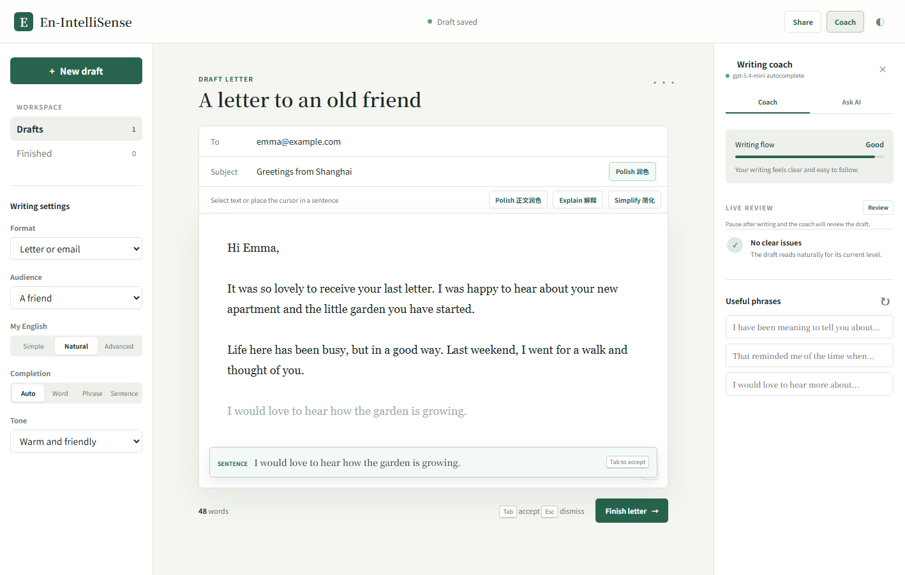
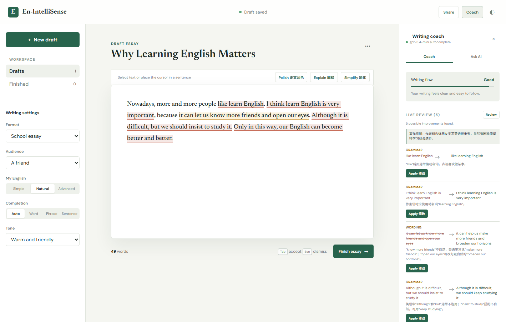
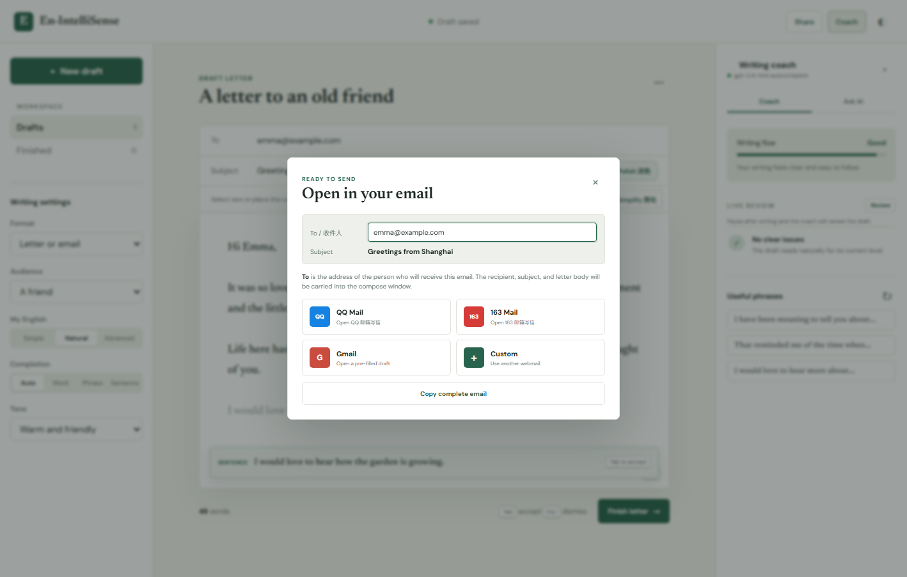

# En-IntelliSense

面向英语学习者的上下文智能写作工具。它会结合整篇草稿推断用户想表达的意思，提供单词、短语和句子补全，并检查语法、清晰度、措辞、重复和语气问题。

在线体验：[en-intellisense.etolucy.workers.dev](https://en-intellisense.etolucy.workers.dev)

文档：[English](README.md) | **简体中文** | [Español](README.es.md) | [日本語](README.ja.md) | [Русский](README.ru.md)

## Demo



### 从中式英语到自然表达

学习者先按照中文逻辑直接写作文。En-IntelliSense 会推断文章真正想表达的观点，在原文中精确标出 5 处问题，用中文解释原因，并提供可以一键应用的自然改写，而不是粗暴地重写整篇文章。



### 完成邮件并打开常用邮箱

完成书信后，可以选择 QQ 邮箱、163 邮箱、Gmail 或自定义邮箱。系统会把收件人、主题和正文带入写信页面。



## 功能

- 本地单词补全，以及模型驱动的短语和句子补全。
- 从完整草稿推断写作意图，并将意图用于后续补全。
- 停笔后自动审查，也可以手动点击 Review。
- 在原文中标出问题，显示中文原因和替换建议，支持一键修改。
- 标题润色、正文润色、中文翻译、表达解释和简单改写。
- Useful phrases 会替换选中内容或光标所在句子，不会继续追加重复内容。
- 支持书信、作文和消息格式，草稿保存在本地浏览器。
- 完成书信后可选择 QQ 邮箱、163 邮箱、Gmail 或自定义邮箱，并带入收件人、主题和正文。
- 已完成文档保存在本地 Finished 列表中，可重新创建编辑副本。

## 配置与运行

复制 `.env.example` 为 `.env`，设置 `OPENAI_API_KEY`。可通过 `OPENAI_MODEL`、`OPENAI_AUTOCOMPLETE_MODEL` 和 `OPENAI_BASE_URL` 配置兼容模型服务。

```powershell
python -m pip install -r requirements.txt
python server.py
```

打开 `http://127.0.0.1:8000`。不要提交 `.env`，也不要把 API Key 写入前端 JavaScript。

## 测试

```powershell
python -m unittest discover -p "test_*.py"
node test_completion.js
```

## 使用方法

- 选择 Auto、Word、Phrase 或 Sentence；按 `Tab` 接受补全，按 `Esc` 忽略。
- 停止输入片刻后会自动审查，也可以点击 Review。
- 点击问题可定位原文，点击 Apply 修改可直接替换。
- 使用 Polish、Explain、Simplify 前可选中文字；未选择时自动使用光标所在句子。
- 点击 Useful phrases 会替换当前句子。

## Cloudflare 部署

仓库通过一个 Worker 同时提供前端和 API。默认使用 Cloudflare Workers AI，因此免费部署不要求外部 API Key。需要改用 OpenAI 兼容服务时，再通过 Secret 配置 `OPENAI_API_KEY` 和 `OPENAI_BASE_URL`。

```powershell
npx wrangler login
npx wrangler deploy

# 可选：外部兼容模型服务
npx wrangler secret put OPENAI_API_KEY
npx wrangler secret put OPENAI_BASE_URL
```

## 友情链接

- [LINUX DO - 新的理想型社区](https://linux.do/)

## 开源协议

[MIT](LICENSE)
