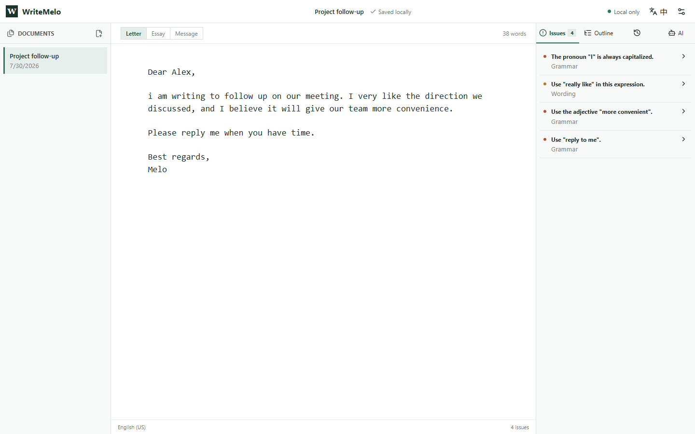
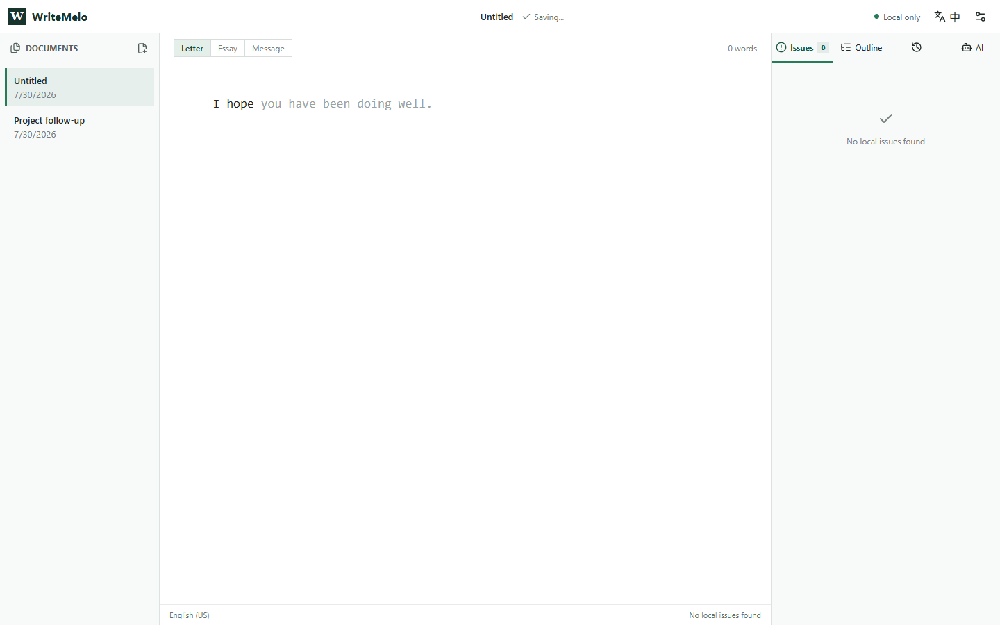
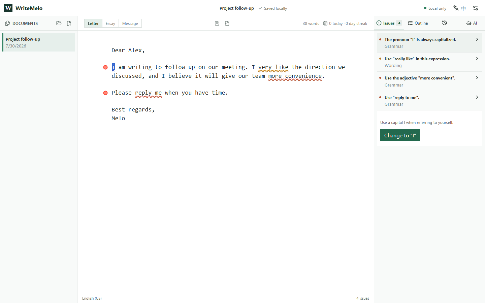
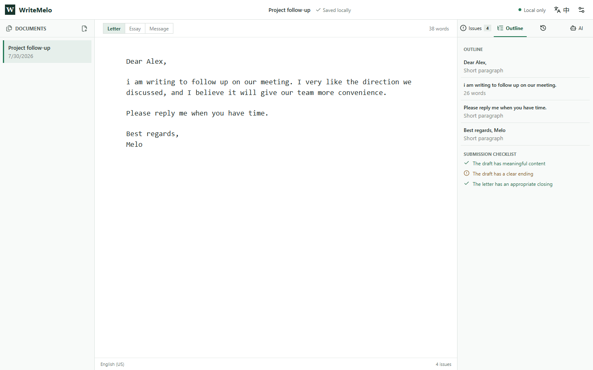
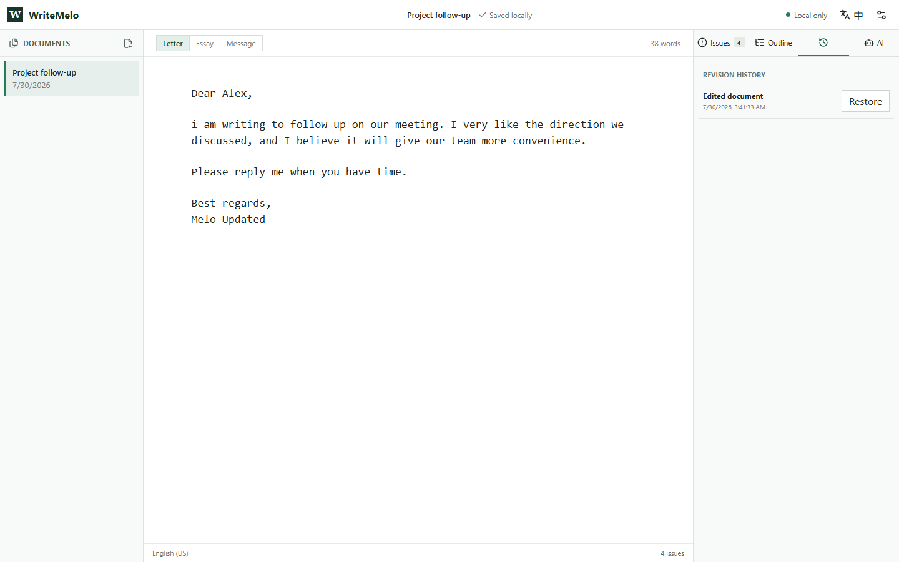
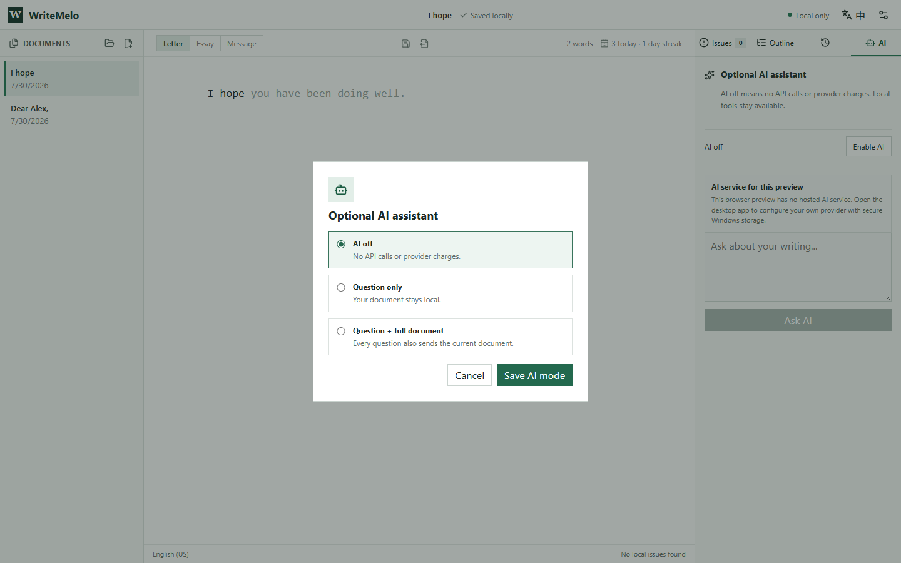
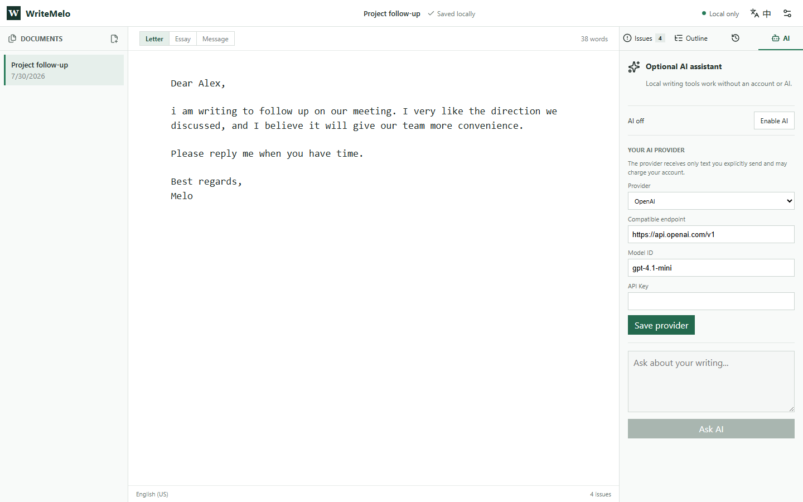

# WriteMelo 完整操作演示

这套 Demo 只完成一个实际任务：把一封英文跟进邮件写好，同时不把草稿直接交给 AI 代写。

```text
Dear Alex,

i am writing to follow up on our meeting. I very like the direction we discussed, and I believe it will give our team more convenience.

Please reply me when you have time.

Best regards,
Melo
```

下列截图全部来自真实运行的应用，可以用 `npm run capture:demo` 重新生成。

## 1. 写英文时，不想在编辑器、词典和纠错网站之间来回切换



**你做什么：** 打开 WriteMelo 后直接写作，并按任务选择 Letter、Essay 或 Message。

**界面发生什么：** 左侧管理文档，中间专注写作，右侧只显示可处理的问题；顶部明确显示当前为本地工作流。

**你得到什么：** 写作、检查和定位不再分散到多个网站，草稿会自动保存在本机。

**联网 / AI：** 不联网，不使用 AI。

## 2. 知道想表达什么，但一句英文组织得很慢



**你做什么：** 在邮件或消息中输入 `I hope `。

**界面发生什么：** 编辑器显示安静的灰色续写；按 `Tab` 接受，按 `Escape` 忽略。

**你得到什么：** 常用英文表达少敲一些字，但没有任何内容会在未经同意时写进文档。

**联网 / AI：** 不联网，不使用 AI；建议来自本地写作核心。

## 3. 句子被标错，却不知道为什么错



**你做什么：** 选中小写 `i` 对应的问题。

**界面发生什么：** WriteMelo 解释规则并给出精确替换，只修改出错范围，不重写整句话。

**你得到什么：** 不只知道“哪里错了”，还能理解原因，并且每次修改仍由你决定。

**联网 / AI：** 不联网，不使用 AI；拼写与规则诊断都在本地运行。

## 4. 邮件写完了，却不确定是否遗漏重要部分



**你做什么：** 打开“大纲”。

**界面发生什么：** 右侧显示各段作用和邮件专用检查清单；点击大纲项可以回到对应段落。

**你得到什么：** 无需从头重读，就能确认问候、正文、请求和结尾是否完整。

**联网 / AI：** 不联网，不使用 AI。

## 5. 改写后发现还不如原来的版本



**你做什么：** 修改文档后打开“版本历史”。

**界面发生什么：** WriteMelo 在本机记录快照，并提供“恢复”操作。

**你得到什么：** 可以放心尝试不同写法，不怕丢失之前的版本。

**联网 / AI：** 不联网，不使用 AI；历史记录只保存在设备上。

## 6. 想借助 AI，但不愿默认上传整篇文章



**你做什么：** 打开“AI”，选择“启用 AI”，再单独决定是否允许发送整篇文档。

**界面发生什么：** 在确认之前 AI 不可使用；允许整篇文档不是默认捆绑选项。

**你得到什么：** 没有账号、没有 AI 时，本地工具仍然完整可用；确实需要深入分析时才主动调用 AI。

**联网 / AI：** 此时仍未发送请求。只有确认后又主动提问，才会调用供应商。

## 7. 想自己决定使用哪个 AI、花多少钱



**你做什么：** 在 Windows 应用中选择 OpenAI、Groq、Together AI、OpenRouter、Ollama 或兼容接口，填写模型；远程供应商还需要 API Key。

**界面发生什么：** 渲染界面不会拿到已经保存的明文 Key。Electron 使用 Windows `safeStorage` 加密保存，并由主进程直接请求所选供应商。

**你得到什么：** 可以按所在地区、隐私要求和预算选择供应商与模型；Ollama 还可以完全在本机运行。

**联网 / AI：** 远程供应商会收到完成请求所必需、且经过你同意的文本，并可能按自身条款收费；localhost 上的 Ollama 不会把请求发给远程供应商。

## 这套流程真正解决什么

WriteMelo 在不开启 AI 时已经有完整价值：补全减少输入，诊断解释错误，快速修复精确修改，大纲检查结构，历史保护草稿。AI 是最后可选的一件工具，不是使用产品的前提。

## 每项功能到底在什么场景下有用

| 用户遇到的具体困难 | WriteMelo 的具体动作 | 用户如何控制 | 实际收益 |
| --- | --- | --- | --- |
| 只记得单词的大概拼法，例如 `enviroment` | 容错匹配并提供正确候选 `environment` | 选择候选才插入 | 不必离开文章查词典 |
| 长单词只写到一半，例如 `conve` | 补全可能的完整单词 | 继续输入或选择候选 | 减少长词输入成本 |
| 知道开头，不知道常用表达怎么接，例如 `I hope ` | 显示灰色短语或句子续写 | `Tab` 接受，`Escape` 忽略 | 保持写作节奏，不强行代写 |
| 文章反复出现人名、课程名、缩写或产品名 | 提取当前文档中的专有名词并参与后续补全 | 用户照常输入前几个字母 | 保持拼写与大小写一致 |
| 正确的姓名或品牌被普通词典标红 | 允许加入个人词典 | 用户逐项确认 | 同一个专有词不再反复报错 |
| 不知道邮件、作文或消息如何起笔 | 按当前文体提供常用片段 | 用户选择片段并填写具体内容 | 解决空白页困难，不替用户决定内容 |
| 输入了拼写错误 | 本地词典标出问题并给出候选 | 用户选择修改或加入词典 | 基础错误不必上传到云端检查 |
| 忘记将 `i` 写成 `I` | 标出精确字符范围并解释规则 | 点击快速修复才修改 | 只改错误，不重写整句 |
| 使用了不自然搭配，例如 `very like` | 建议 `really like` 并解释措辞问题 | 每条建议单独采纳 | 处理“单词都对但组合不自然” |
| 动词搭配错误，例如 `reply me` | 建议 `reply to me` | 每条建议单独采纳 | 学会常见固定搭配 |
| 词性用错，例如 `more convenience` | 建议 `more convenient` | 每条建议单独采纳 | 理解名词和形容词的差别 |
| 一篇文章混用了美式和英式拼写 | 按文档选择 `English (US)` 或 `English (UK)` | 用户在设置中切换 | 满足学校或公司的统一规范 |
| 邮件、作文和聊天消息被用同一标准检查 | Letter、Essay、Message 使用不同片段和清单 | 用户选择文体 | 提示与真实任务相符 |
| 初学者不需要被复杂词汇淹没 | 按学习等级调整候选 | 用户选择学习等级 | 建议更贴近当前能力 |
| 长文写到后面看不清结构 | 将段落整理成可点击大纲 | 点击大纲项回到原文 | 快速发现缺段和结构失衡 |
| 发送邮件前担心漏掉问候、请求或结尾 | 根据文体生成提交检查清单 | 用户逐项检查 | 降低“语言没错但邮件不完整”的风险 |
| 大幅修改后想找回旧草稿 | 自动保存本地版本快照 | 用户选择某个版本恢复 | 可以放心尝试不同写法 |
| 同时处理多封邮件或多篇文章 | 左栏保存并切换多个本地文档 | 用户新建、切换或删除 | 避免草稿散落在多个临时文件 |
| 不想注册账号、联网或使用 AI | 补全、拼写、诊断、大纲和历史都在本地工作 | AI 保持关闭 | 免费、离线也能获得核心价值 |
| 本地规则无法判断语气是否强硬 | 用户明确启用后再向 AI 提问 | 整篇发送还需单独勾选 | 只把 AI 用在规则工具不擅长的地方 |
| 已有 API Key，或不想购买平台套餐 | Windows 应用直连用户选择的供应商 | 用户选择供应商、模型和接口 | 按自己的预算与地区选择服务 |
| 不愿把文字发送到远程 AI | 连接 localhost 上的 Ollama | 用户自行运行本地模型 | AI 请求仍留在本机 |

## 哪些功能不需要 AI

WriteMelo 的核心工作流不依赖 AI。大约 80% 的日常能力可以在设备上完成，AI 只处理规则系统难以可靠判断的深层语义问题。

### 完全在本地实现

- 单词前缀补全与拼错后的容错候选。
- 本地英文词典和拼写检查。
- 当前文章中的人名、课程名、缩写和产品名复用。
- 个人词典。
- 邮件、作文和消息常用片段。
- 固定短语的灰色续写，以及 `Tab` 接受、`Escape` 忽略。
- 大小写、常见搭配和常见词性错误检查。
- 美式与英式拼写选择。
- Letter、Essay、Message 对应的大纲与提交检查清单。
- 自动保存、多文档管理和本地版本历史。
- 中英文界面。

这些能力由本地词典、拼写算法、英语规则库、常用搭配库、文体片段库、当前文档分析和候选排序共同完成，不需要账号、网络请求或 API Key。

### 本地可以实现，但覆盖范围有限

- 根据前文推荐下一个单词或短语。
- 较长的固定表达续写。
- 复杂程度有限的语法、重复表达和清晰度检查。
- 按学习等级调整候选。
- 根据本地使用记录调整候选排序。

例如 `I hope → you have been doing well.`、`Thank you for → your time and consideration.` 这类高频表达可以本地完成。对于开放式、低频或强依赖全文含义的续写，本地规则只能给出有限建议，不能假装真正理解语义。

### 更适合由用户主动调用 AI

- 判断邮件语气是否强硬、冒犯、含糊或不符合特定关系。
- 理解全文后发现逻辑矛盾或论证缺口。
- 根据收件人和目的调整正式程度。
- 解释规则库没有覆盖的复杂句子。
- 提供多种自然改写并说明语气区别。
- 深入评价作文论证结构。
- 生成开放式句子或段落续写。
- 回答用户针对当前文章提出的问题。

产品边界因此是：

```text
本地核心：高频、确定、低成本的日常写作能力，默认开启
AI 增强：复杂语义、语气和开放式生成，用户主动启用
```

WriteMelo 不宣称本地规则能够穷尽英语语法。它承诺的是：日常补全、拼写、常见错误、术语一致性和文档结构不必使用 AI；确实需要深层理解时，再由用户决定是否发送文本和承担供应商费用。
